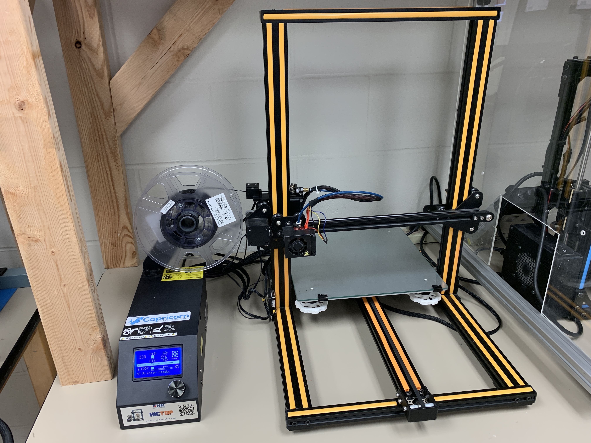
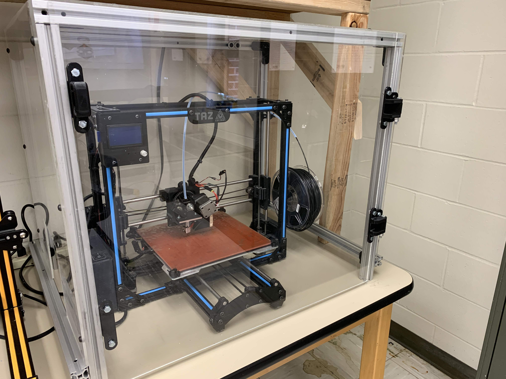

# 3D-Printing

This repository is the Student Project and Research Committee's reference to 3D printing on the 3D printers in our lab, Broun 367.  We currently have two 3D printers: Creality CR10-S (purchased Spring 2018) and Lulzbot Taz 3 (purchased Fall 2014).  The printers are open for SPARC, research, and personal projects.  The filament is provided for all SPARC projects.  We ask that you provide your own filament if your research project is using more than 500g (half a standard roll) or your personal project is using more than 250g (quarter of a standard roll).  Please see the sections on the individual 3D printers on which filaments can be used.  If you want to use a filament other than PLA or ABS please contact the Director of Lab Operations for permission so they can analyze whether the proposed filament will be safe on the respective printer.

Also included in these sections is instructions on how to get started.  We ask that you do not use the printers without being trained by a SPARC member if you have never used a 3D printer.  3D printing is a great skill to have and can be used for so many projects.  To be good at 3D printing like anything else, it takes practice and experimentation through trial and error.  Once you gain experience you will learn which settings work best for each type of filament for each printer and techniques to ensure more successful prints.
_____
## Creality CR-10S

Amazon Link: [https://www.amazon.com/HICTOP-Printer-Filament-Monitor-300x300x400mm/dp/B074QLQSQV/ref=sr_1_1?ie=UTF8&qid=1518213852&sr=8-1&keywords=cr10s](https://www.amazon.com/HICTOP-Printer-Filament-Monitor-300x300x400mm/dp/B074QLQSQV/ref=sr_1_1?ie=UTF8&qid=1518213852&sr=8-1&keywords=cr10s)

### Filaments
This printer is a filament based, fused deposition modeling printer with a build volume of 300x300x400mm.  **It uses 1.85mm filament.**  

We usually use [eSun PLA Pro/+](https://www.amazon.com/eSUN-1-75mm-Printer-Filament-2-2lbs/dp/B01EKEMDA6/ref=sxts_sxwds-bia?keywords=pla+pro+esun&pd_rd_i=B01EKEMDA6&pd_rd_r=ec9bb897-97ca-42fe-a565-9f7e6c7da78f&pd_rd_w=OoITB&pd_rd_wg=pYOOI&pf_rd_p=b0a90583-d22c-4c32-806b-f09cd6946e61&pf_rd_r=SBPK7YF1KYET3YD4AFNW&qid=1560726443&s=gateway) as it has better properties than standard PLA but standard PLA also prints well on this printer.  The recommended temperature for PLA Pro is `215C` for the extrusion head and `60C` for the bed.  We print the PLA directly on the glass.  The bed needs to be very well leveled in order to ensure proper adhesion.

ABS can be printed on this printer when it is in the enclosure but is not simple to do so.  The recommended temperatures for ABS is `230C` and `100C` respectively.  The heated bed takes a long time (~20-30min) to reach this temperature thus this printer is not ideal for printing in ABS.  Because there is no film on the bed, it may be required to use a little gluestick to help the filament adhere to the bed.  Cleanup the bed after using gluestick with isopropyl alcohol or acetone (nail polish remover).

### Software
The latest slicing software tested with this printer is [Cura 3.6](https://ultimaker.com/en/products/ultimaker-cura-software/list).  To add the printer to Cura, press Settings > Printer > Add Printer... > Other > Creality CR-10S.  We recommend that you start out by using the profiles in the `CR-10_Profiles` folder of this repository.  To add a profile, press Settings > Profiles > Manage Profiles... > Import.  The biggest thing to consider changing is to enable or disable support structure.
_____
## Lulzbot Taz 3

### Filaments
This printer is a filament based, fused deposition modeling printer with a build volume of 290x270x250mm.  **It uses 3mm filament.**  We usually use ABS with this printer.  PLA also works well on this printer.  There is a PEI film on the glass bed so no gluestick is required to help the print adhere.

### Modifications
After numerous hot end replacements, we upgraded to the Lulzbot Taz 5 hot end: [lulzbot-v2-hexagon-hot-end](https://www.lulzbot.com/store/parts/lulzbot-v2-hexagon-hot-end).  To support this change, we had to print some replacement extruder brackets found in the `Taz_Parts` folder.  These have to be printed in ABS so they do not warp when printing with higher temperature filaments.  We also upgraded the firmware to match a Lulzbot Taz 5 with modifying the lead screw scaling.  

### Software
The latest slicing software tested with this printer is [Lulzbot Cura 2.6.66](http://download.lulzbot.com/Software/cura-lulzbot/windows/).  The custom machine settings can be found in the Taz_Profiles folder.  We recommend that you start out by using the profiles in the `Taz_Profiles` folder of this repository.  To add a profile, press Settings > Profiles > Manage Profiles... > Import.  The biggest thing to consider changing is to enable or disable support structure.
_____
## Notes about Humidity
3D printing filament is sensitive to moisture and dramatic temperature differences.  To ensure the best quality print for longer prints, make sure the windows are closed so the temperature does not fluctuate dramatically throughout the day and night.  When we receive new filament, we usually put the moisture absorbant desicants in the green cabinet to help keep the stored filament from deteriorating due to moisture in the air.  Certain filaments like Nylon are especially sensitive.
_____
## SPARC 3D Models
Members of SPARC have create numerous 3D printed creations over the years.  A good place for sharing these files in the website thingiverse.com.  Our organization has its own Thingiverse organization: [https://www.thingiverse.com/groups/sparc/things](https://www.thingiverse.com/groups/sparc/things).